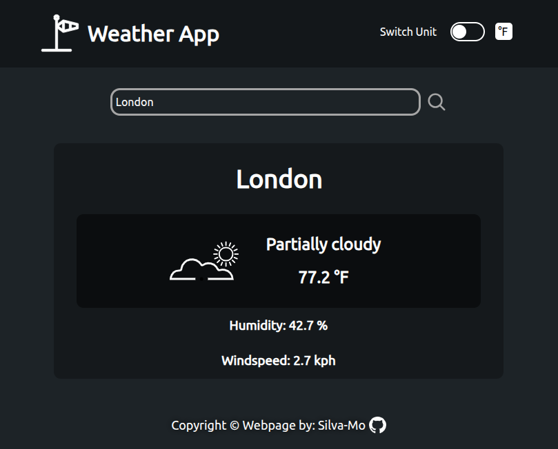

# Weather App

## Result

  
[LIVE DEMO](https://silva-mo.github.io/weather-app)

## About

This is my fourth JavaScript project from **The Odin Project** curriculum — a fully functional **Weather App**.  
It deepened my skills in **API handling**, **asynchronous JavaScript** (`async/await` & Promises), and improved my approach to **frontend UI handling**.  
I also implemented **loading components** and basic **frontend error handling** for a better user experience.

Alhamdulillah

## What was needed to complete it:

- Fetching and processing data from a public Weather API
- Using **`async/await`** and **Promises** for clean asynchronous code
- Integrating the **Geolocation API** to get user location-based weather
- Adding **loading components** during data fetch
- Handling simple frontend errors for failed API requests
- Using **dynamic imports** for efficient code splitting
- Creating a responsive and visually appealing UI

## Challenges that I’ve overcome:

- Working with the **Geolocation API** while managing user permissions and errors
- Implementing **dynamic imports** without breaking the Webpack build
- Ensuring smooth loading states and clear error messages
- Handling asynchronous code in a modular, maintainable way
- Making the UI responsive and consistent across devices

## Tech Stack

- JavaScript (ES6)
- HTML5
- CSS3 (Flexbox & Grid)
- Webpack
- Weather API

---

✅ Built with care — feel free to explore or contribute!
